# もじごと

VS Code で小説や長文を書くための執筆補助拡張です。

原稿管理、縦書きプレビュー、作品設定、プロット・資料ノート、構想メモ、執筆メモ、文字数集計、書き出しなどを、VS Code 上でまとめて管理できます。

- [もじごと HOW TO サイト](https://mojigoto.hasakudo.com)
- [主な機能](#主な機能)
- [インストール](#インストール)
- [はじめかた](#はじめかた)
- [Single / Multi モード](#single--multi-モード)
- [作品ツリー](#作品ツリー)
- [縦書きプレビュー](#縦書きプレビュー)
- [ステータスバー](#ステータスバー)
- [ノートとメモ](#ノートとメモ)
- [Dashboard](#dashboard)
- [書き出し](#書き出し)
- [既定ショートカットキー](#既定ショートカットキー)
- [Google Sheets 連携](#google-sheets-連携)
- [不具合報告](#不具合報告)

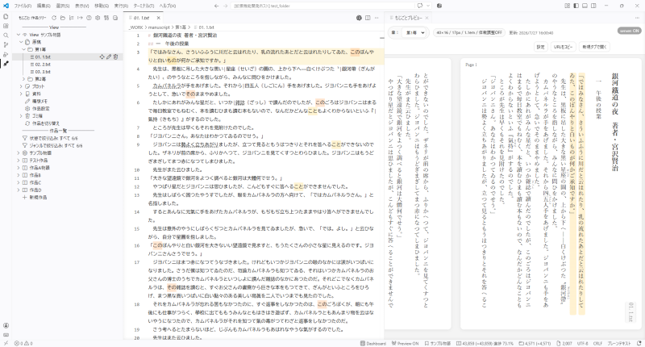

---

## 主な機能

- `.txt` / `.md` 原稿の管理
- 縦書きプレビュー
- Single / Multi モードによる作品管理
- 作品ツリーからの原稿・プロット・資料・設定管理
- プロット / 資料ノート
- 構想メモ / 執筆メモ / 項目メモ
- ルビ、傍点、括弧、三点リーダ、ダッシュなどの入力補助
- 文字数カウント、執筆記録、Dashboard
- ハイライト分析
- 原稿、設定、ノートの書き出し
- Google Sheets 連携（任意）

---

## こんな人向け

- VS Code で小説や長文を書きたい
- 原稿、プロット、資料、メモを同じ環境で管理したい
- 縦書きで本文の見え方を確認したい
- 作品ごとの文字数や進捗を確認したい
- 複数作品を切り替えながら管理したい

---

## 動作環境

- VS Code 1.80 以上
- 原稿ファイル：`.txt` / `.md`
- 縦書きプレビューを使う場合：Node.js 18 LTS 以上

> Node.js は縦書きプレビュー用です。  
> 縦書きプレビュー以外の機能は、Node.js なしでも利用できます。

---

## インストール

1. VS Code の拡張機能ビューを開く
2. `もじごと` を検索する
3. Publisher が「葉さく堂」（Publisher ID: `hasakudo`）の拡張機能を選び、「インストール」を押す

インストール後、サイドバーの「もじごと」アイコンから初回セットアップを開始できます。

---

## はじめかた

1. 小説用のフォルダを VS Code で開く
2. もじごと案内板に従って初回セットアップを行う
3. Single / Multi モードを選ぶ
4. 原稿フォルダと新規作品を作成する
5. 作品ツリー、Dashboard、縦書きプレビューなどを開いて使う

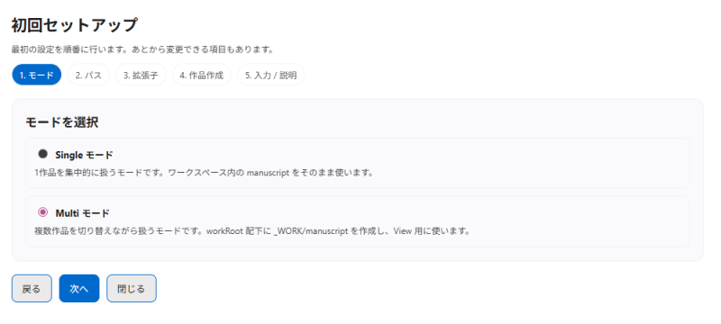

詳しい使い方は、拡張内の `もじごと:もじごとガイドを開く` から確認できます。

---

## Single / Multi モード

もじごとには、2つの管理モードがあります。

### Single モード

1つの作品だけを扱うモードです。  
シンプルに使いたい場合に向いています。

```txt
workspace/
├ .mojigoto/
└ manuscript/
   ├ 01.txt
   └ 02.txt
```

### Multi モード

複数作品を切り替えて扱うモードです。  
作品ごとに原稿、設定、プロット、資料、メモを分けて管理できます。

```txt
workspace/
├ _WORK/
│  └ manuscript/
├ workA/
│  ├ manuscript/
│  └ .mojigoto/
└ workB/
   ├ manuscript/
   └ .mojigoto/
```

Multi モードでは、作品を切り替えると `_WORK/manuscript` に現在の作品の原稿が連携されます。

---

## 作品ツリー

もじごとの作品ツリーでは、次のような操作ができます。

- 原稿ファイル / 章フォルダの作成
- 原稿ファイルの移動、名前変更、削除
- プロット / 資料ノートの作成
- 作品設定の編集
- 構想メモを開く
- ごみ箱からの復元
- 原稿やノートの書き出し
- Multi モードでの作品切り替え

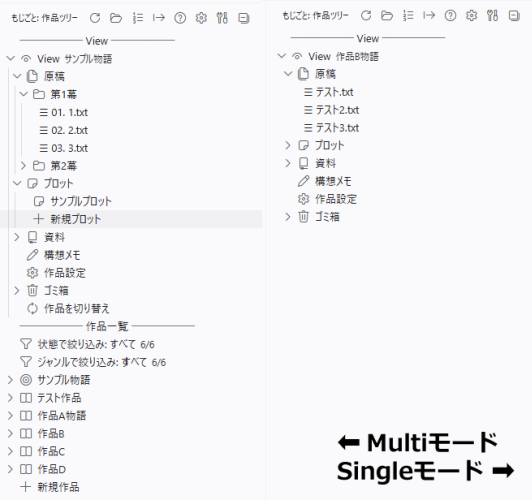

---

## 縦書きプレビュー

縦書きプレビューでは、編集中の原稿を縦書きで確認できます。

- 章ごとの表示
- カーソル位置への追従
- 文字数、行数、行送り、フォントサイズの調整
- 背景色テーマの変更
- 句読点処理（ぶら下げ / 追い込み）と体裁調整の ON / OFF
- ブラウザ表示用URLのコピー


---

## ステータスバー

原稿に関する機能が並んでいます。  
クリックすると各機能を呼び出せます。

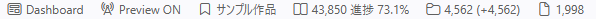

- Dashboard：ダッシュボードパネルを開く
- Preview：縦書きプレビューを起動、画面を開く
- 作品名：Multi モードの場合、クリックすると作品の切り替えが可能
- 総文字数 + 目標達成率
- 章の総文字数
- ファイルの文字数

---

## ノートとメモ

### プロット / 資料ノート

プロットと資料は、大分類・区分・項目で整理できます。  
入力内容はリスト表示やボード表示で確認できます。

#### エディタとプレビュー
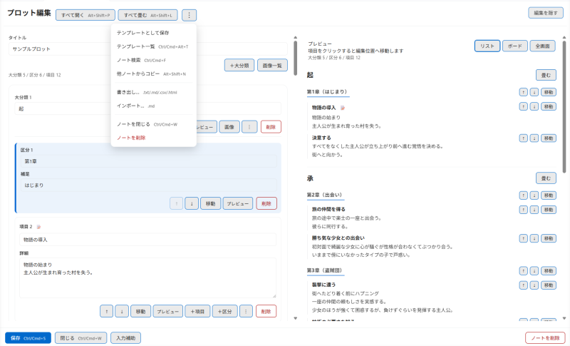

#### ボードプレビュー全画面
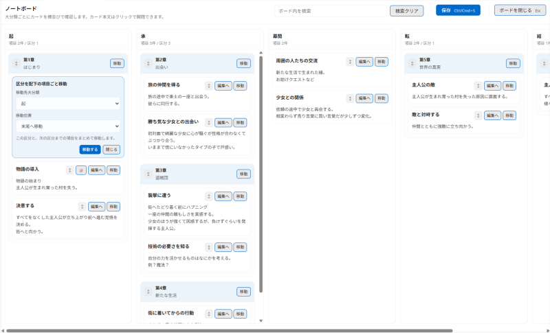

### 構想メモ

作品全体のメモ、TODO、リストを残せます。  
ダッシュボードに表示するメモを選ぶこともできます。

#### 項目メモや執筆メモのコピーも管理
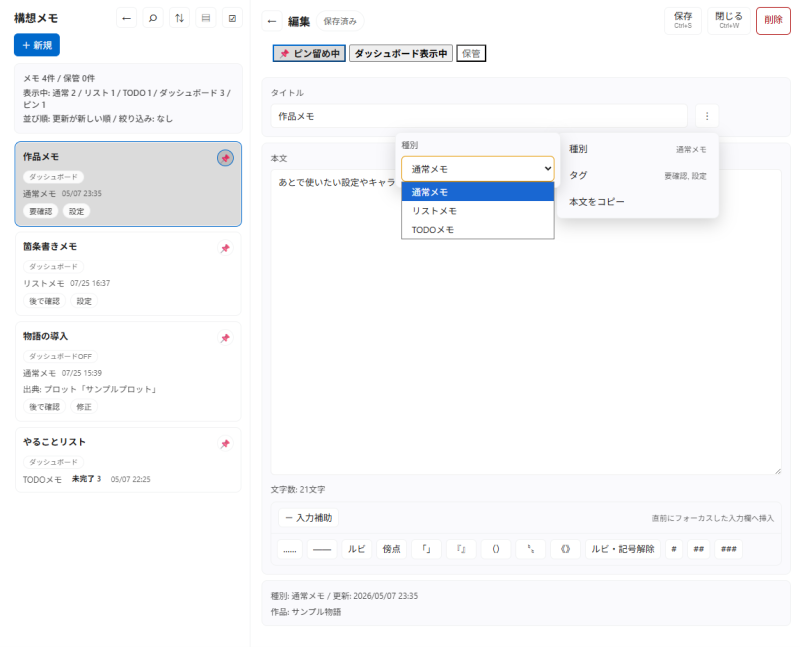

### 執筆メモ

原稿中の選択範囲に短いメモを残せます。  
あとで直したい箇所、確認したい表現、保留したい文章などに使えます。

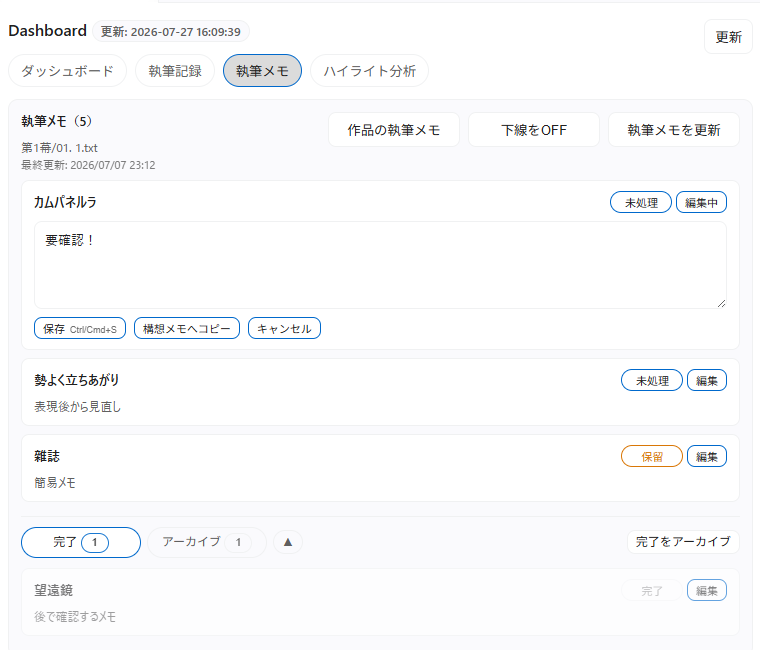

---

## Dashboard

Dashboard では、作品の進捗や執筆データを確認できます。

- 今日の総差分
- 総文字数
- 目標文字数と進捗率
- 締切までの日数
- 今日更新したファイル
- 章別の差分
- 構想メモ
- 執筆メモ
- ハイライト分析

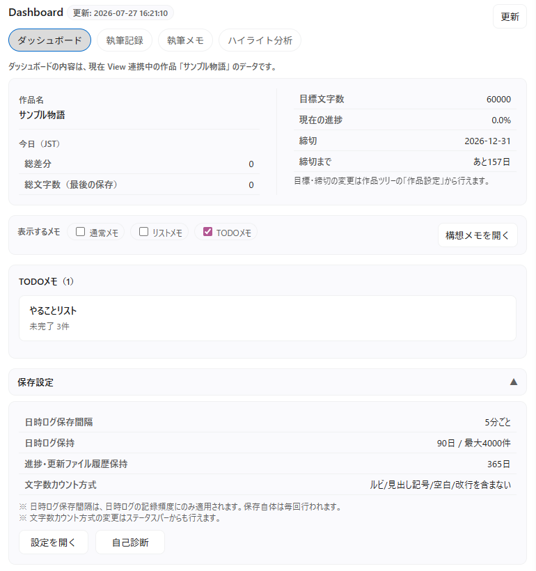

---

## 書き出し

原稿やノートを外部ファイルとして書き出せます。

### 原稿

- `.txt`
- `.md`
- `.html`（Word 変換向け）
- `.html`（横書き / 印刷・PDF保存向け）
- `.html`（縦書き / 印刷・PDF保存向け）

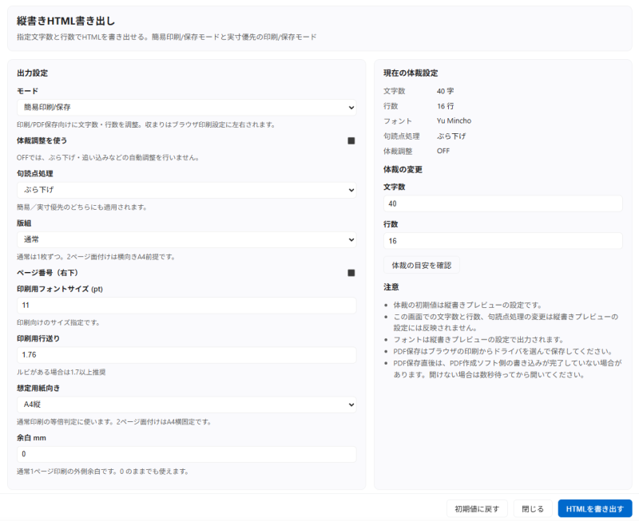

`.html`（縦書き / 印刷・PDF保存向け）のみ専用パネルがあります。  
簡易印刷/保存モード と 実寸優先モード

### 設定 / プロット / 資料

- `.txt`
- `.md`
- `.csv`
- `.html`

書き出し先は、VS Code 設定の `Export Root` を基準に、作品ごとのフォルダへ保存されます。  
3つをまとめて書き出すことも可能です。

---

## 入力補助

原稿やノートの編集時に、次の入力補助を利用できます。

- ルビ：`|文字《よみ》`
- 傍点：`《《文字》》`
- 三点リーダ：`……`
- ダッシュ：`――`
- 括弧で囲む：`「」` / `『』` / `（）` / `〝〟` など
- 見出し記号：`# ` / `## ` / `### `
- 自動字下げ
- 閉じ括弧補助

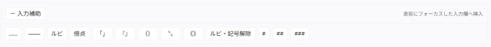

右クリックで挿入や入力補助バーの表示があります。

---

## 既定ショートカットキー

| キー              | 機能                       |
| ----------------- | -------------------------- |
| `Ctrl + Alt + V`  | 縦書きプレビューを開く     |
| `Ctrl + Alt + S`  | プレビューサーバーを停止   |
| `Ctrl + Alt + R`  | プレビューサーバーを再起動 |
| `Alt + R`         | ルビを挿入                 |
| `Alt + B`         | 傍点を挿入                 |
| `Shift + Alt + C` | ルビ / 傍点を解除          |
| `Shift + Alt + .` | 三点リーダを挿入           |
| `Shift + Alt + -` | ダッシュを挿入             |
| `Alt + M`         | 執筆メモを追加             |

ショートカットキーが既存の設定と衝突する場合は、VS Code の「キーボードショートカット」から変更してください。

---

## Google Sheets 連携

Google Sheets 連携は任意機能です。  
執筆記録や日時ログを Google スプレッドシートへ送信できます。

利用する場合は、拡張内の「もじごとガイド」から Google Sheets 連携の手順を確認してください。

---

## 不具合報告

不具合や要望は [GitHub Issues](https://github.com/hasakudo/mojigoto/issues) へお寄せください。

---

## 注意事項

- もじごとは `.txt` / `.md` を扱う執筆向け拡張です。
- 小説以外のプロジェクトでも動作する場合があります。
- 小説用の VS Code プロファイルを作成し、そのプロファイルに入れて使う運用をおすすめします。
- Multi モードでは、基本的に View 原稿に連携中の作品が各機能の対象になります。

---

## ライセンス

[MIT License](LICENSE)
